# Azure Migration Tool – Architecture (Low-Level)

This document describes the application architecture, components, and data flows. All diagrams use Mermaid and render in Markdown viewers that support it (e.g. GitHub, VS Code).

---

## 1. High-Level Component Overview

```
┌─────────────────────────────────────────────────────────────────────────────────┐
│                           AZURE MIGRATION TOOL                                    │
├─────────────────────────────────────────────────────────────────────────────────┤
│  ENTRY (main.py)                                                                 │
│    → Tk root, DependencyChecker (setup/auto_setup), MainWindow (gui/main_window) │
├──────────────┬──────────────┬──────────────┬──────────────┬──────────────────────┤
│  GUI LAYER   │  ORCHESTRATION │  SERVICES   │  VALIDATION  │  SETUP / UTILS       │
│  main_window │  full_migration│  backup/    │  schema_     │  auto_setup,         │
│  tabs/*      │                │  restore/   │  data_service│  driver_utils,       │
│  widgets/    │                │  migration  │  run_subproc │  adf_client          │
│  utils/      │                │             │  connections │  azure_token_cache   │
│  dialogs/    │                │             │              │                      │
├──────────────┴──────────────┴──────────────┴──────────────┴──────────────────────┤
│  DATA / AUTH: src/utils/database, gui/utils/database_utils, MSAL (azure_token_cache) │
│  CONFIG: config.json, project.json, database_config.json, env vars                │
└─────────────────────────────────────────────────────────────────────────────────┘
```

---

## 2. Application Entry & Startup Flow

```mermaid
flowchart TB
    subgraph Entry["Entry (main.py)"]
        A[main]
        A --> B{getattr(sys, 'frozen')?}
        B -->|Exe| C[Set app_dir = _MEIPASS / exe.parent]
        B -->|Script| D[Set app_dir = __file__.parent]
        C --> E[Insert gui, setup, utils, src, backup into sys.path]
        D --> E
        E --> F[tk.Tk]
        F --> G[Root.withdraw]
        G --> H[DependencyChecker.quick_check]
        H --> I{All OK?}
        I -->|No| J[MessageBox: install Java/ODBC/JDBC]
        I -->|Yes| K[Root.deiconify]
        J --> K
        K --> L[MainWindow(root)]
        L --> M[root.mainloop]
    end
```

---

## 3. GUI Layer – Main Window & Tabs

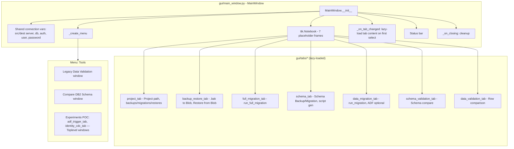

---

## 4. GUI Sub-Components (Widgets, Utils, Dialogs)

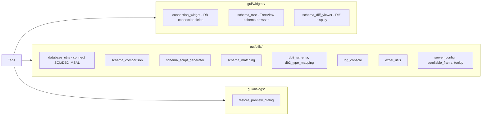

---

## 5. Core Services – Backup, Restore, Migration

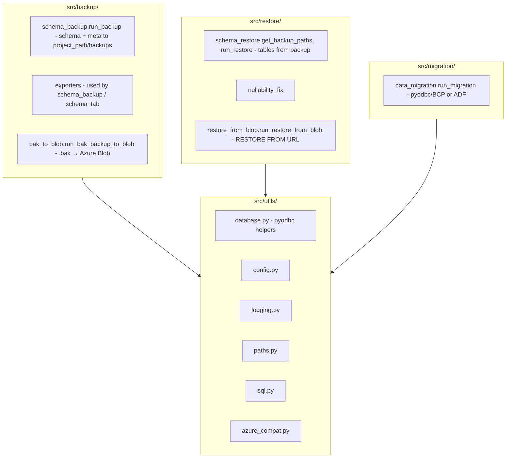

---

## 6. Full Migration Orchestration Flow

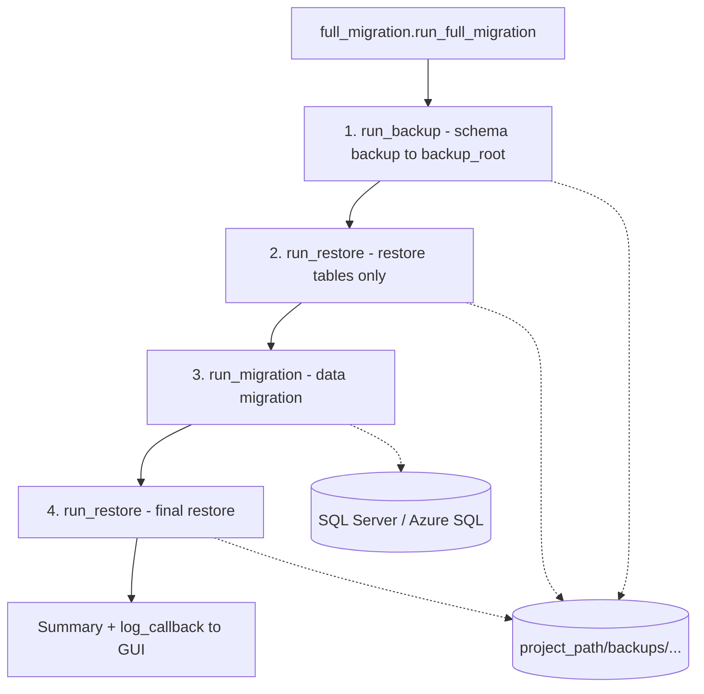

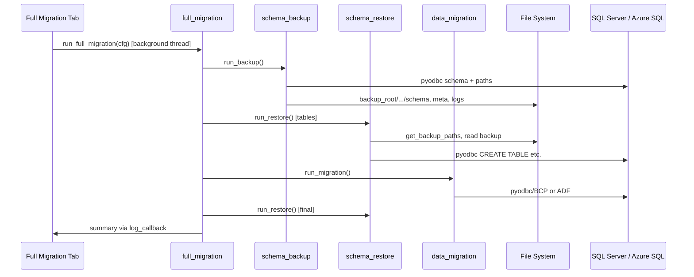

---

## 7. Validation Layer (Legacy – DB2 ↔ Azure SQL)

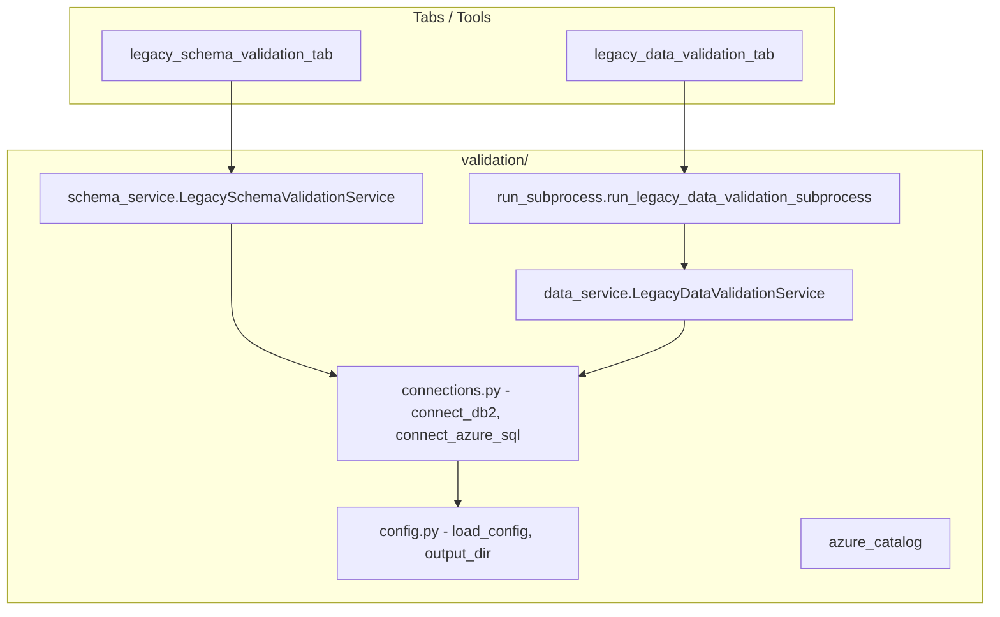

---

## 8. Legacy Data Validation – Subprocess & Queue

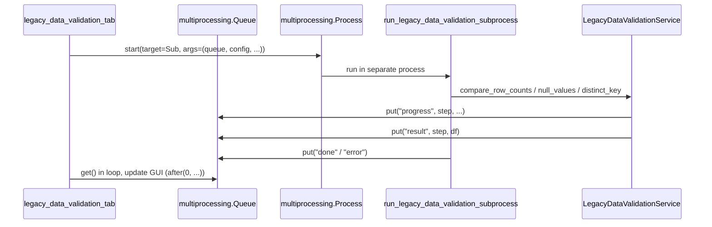

---

## 9. Data & Auth Flow

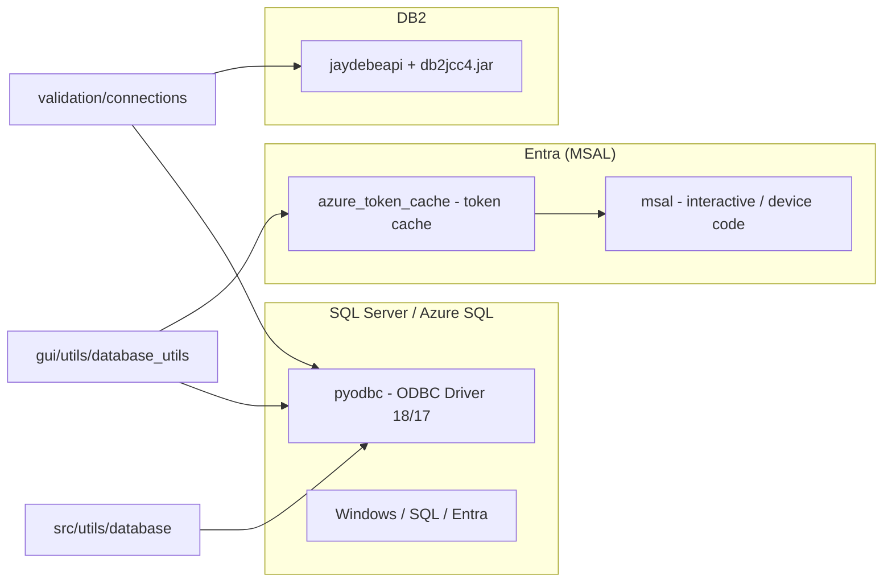

---

## 10. File System Layout (Project & Backups)

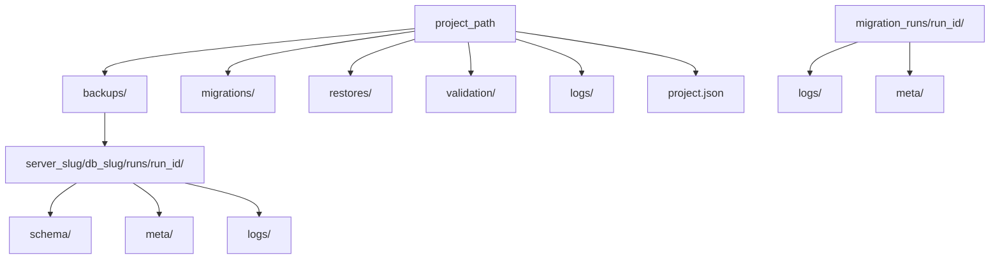

---

## 11. Azure Integration

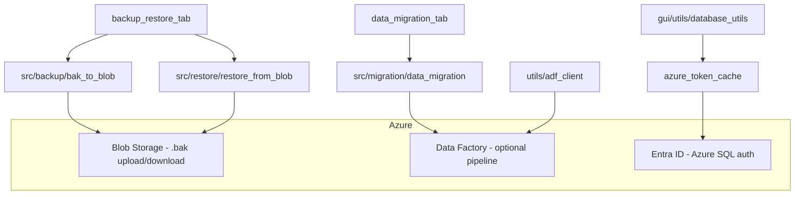

---

## 12. Build Pipeline

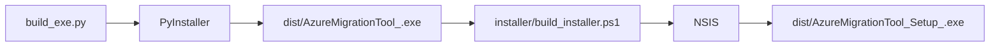

**Branding:** Put `resources/logo.png` in the app package. `build_exe.py` uses **Pillow** (auto-installed if missing) to generate `resources/app.ico`, embeds it in the PyInstaller **exe**, and the NSIS script uses the same `.ico` for the installer wizard when `app.ico` exists (`!if /FileExists`). See `resources/README.md` and `requirements-build.txt`.

The NSIS script (`installer/AzureMigrationTool.nsi`) uses the **MultiUser** plugin: installers can target **current user** (default under `%LOCALAPPDATA%\Programs\`, HKCU, per-user Start Menu) or **all users** (`Program Files`, HKLM, common Start Menu; UAC when needed). Bundled **ODBC 18 MSI** runs only for **all-users** installs; per-user installs skip it (install ODBC separately). Silent flags: `/CurrentUser` or `/AllUsers` with `/S`.

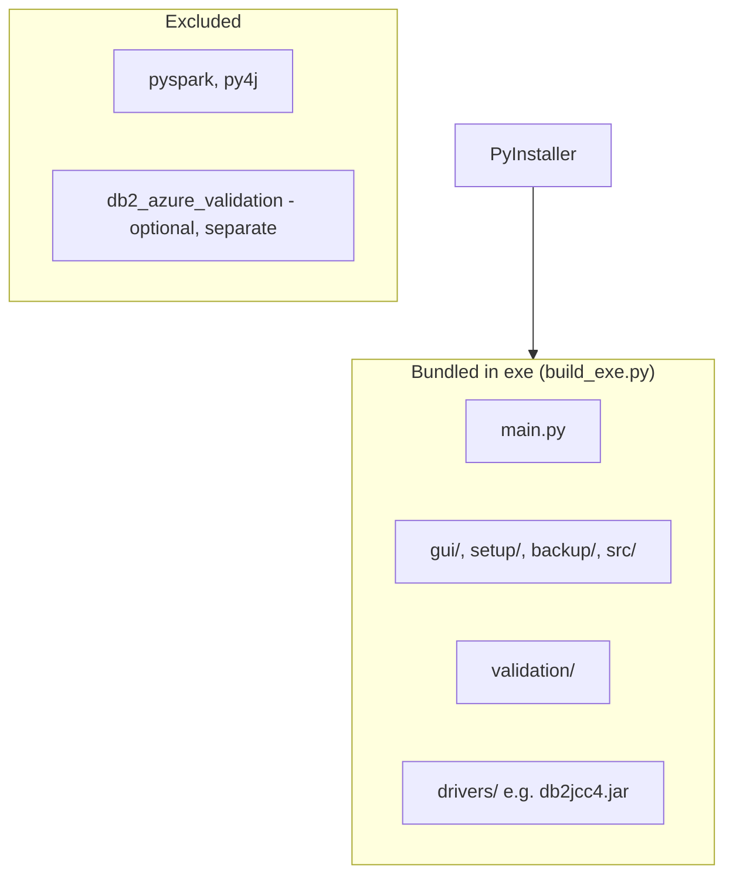

---

## 13. CI/CD (GitHub Actions)

```mermaid
flowchart LR
    TRIGGER[Push main/master, tag v*, release, workflow_dispatch]
    TRIGGER --> CHECKOUT[Checkout]
    CHECKOUT --> PY[Python 3.11, install deps + PyInstaller]
    PY --> BUILD[python azure_migration_tool/build_exe.py]
    BUILD --> EXE[dist-versioned/AzureMigrationTool-<ver>.exe]
    EXE --> NSIS[Install NSIS, build_installer.ps1]
    NSIS --> SETUP[dist-versioned/AzureMigrationTool_Setup_<ver>.exe]
    SETUP --> RELEASE[Create/update GitHub Release]
```

---

## 14. Dependency Overview

| Layer        | Component / path | Role |
|-------------|-------------------|------|
| Entry       | `main.py`         | Tk root, DependencyChecker, MainWindow |
| UI          | `gui/main_window.py` | Tabs, menu, shared connection vars |
| UI          | `gui/tabs/*.py`   | Project, Backup & Restore, Full Migration, Schema, Data Migration, Schema/Data Validation |
| UI          | `gui/widgets/`, `gui/utils/`, `gui/dialogs/` | Connection, schema tree, diff, DB utils, `schema_remap` / `compare_keys` (validation keys), script gen, Excel, restore preview |
| Orchestration | `src/orchestration/full_migration.py` | run_full_migration: backup → restore tables → migrate → restore |
| Services    | `src/backup/schema_backup.py` | run_backup |
| Services    | `src/backup/bak_to_blob.py` | run_bak_backup_to_blob |
| Services    | `src/restore/schema_restore.py` | get_backup_paths, run_restore |
| Services    | `src/restore/restore_from_blob.py` | run_restore_from_blob |
| Services    | `src/migration/data_migration.py` | run_migration |
| Validation  | `validation/schema_service.py`, `validation/data_service.py` | Legacy DB2 ↔ Azure SQL |
| Subprocess  | `validation/run_subprocess.py` | Legacy data validation in separate process + Queue |
| Setup       | `setup/auto_setup.py`, `utils/driver_utils.py` | ODBC/Java/PySpark/DB2 check and install |
| Optional    | `utils/adf_client.py` | Azure Data Factory |
| Config      | `config.json`, `project.json`, `database_config.json`, env vars | |

---

## 15. Threading Model

- **Main thread**: Tk event loop (GUI).
- **Background threads**: Long operations (full migration, schema backup/restore, data migration, backup/restore to/from blob, schema/data validation) run in `threading.Thread(..., daemon=True)`; results and log messages are pushed to the UI via `frame.after(0, ...)`.
- **Legacy data validation**: Runs in a separate **process** (`multiprocessing.Process`) with a **multiprocessing.Queue** so the JVM (DB2/JDBC) does not block the main process; the UI thread reads from the queue and updates the GUI.

---

*Generated for Azure Migration Tool. Diagrams use Mermaid; render in a Markdown viewer that supports Mermaid (e.g. GitHub, VS Code with Mermaid extension).*
